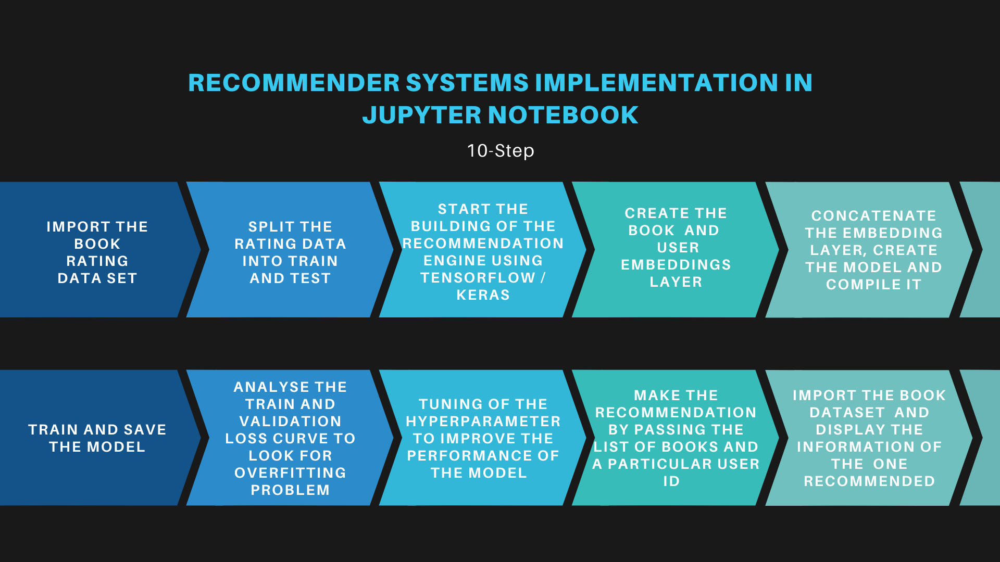

### Author: Leo Biaggi , Hanane Ouhammouch

# Book recommendation with AzureDevOps CICD integration

The Object of this Project is to build and deploy a recommendation System to predict the rating a user will give to a book based on his old preferences. 

## Prerequisite
- Anaconda - Jupyter Notebook for the creation of the Model
- Azure DevOps for the deployment of the Model

## From the creation to the deployment  :

You can find bellow more details :

### Model Implementation using Jupyter Notebook :

#### Introduction of recommendation system :

A recommendation system seeks to model a user Behavior regarding a Product , which help to understand how user interact with items.

There are 3 type of recommendation system :

1. Collaborative Filtering System:This system builds a model of the user based on past choices, activities, and preferences. 

2. Content-Based Filtering System:This system builds an understanding of similarity between items. It recommends items that are similar to each other in terms of properties.

3. Hybrid Approach : This approach combines the collaborative and content-based approaches to build  more generalized systems. 

#### Approach used in this Project:

This Project used a technique called embedding *(special kind of neural network layer)* to build an understanding of the interaction between users and book **which is an hybrid approach**

#### Library used in this Project:

This model used  **Keras** And **TensorFlow** for the implementation 

1.Keras: an open-source neural-network library written in Python. It is capable of running on top of TensorFlow https://keras.io/

2.Tensorflow :is a Python library for fast numerical computing created and released by Google.It is a foundation library that can be used to create Deep Learning models directly or by using wrapper libraries that simplify the process built on top of TensorFlow *(Keras)*

#### Procces of the model Implementation in Jupyter Notebook:

#### Build Pipeline
1. Go to the **Pipelines -> Builds** on the newly created project and click **Edit** on top right

2. Click on **Create or Get Workspace** task, select the Azure subscription where you want to deploy and run the solution, and click **Authorize**

3. Click all other tasks below it and select the same subscription (no need to authorize again)
4. Once the tasks are updated with subscription, click on **Save & queue** and select **Save**

#### Release Pipeline
1. Go to the **Pipelines -> Releases** and click **Edit** on top  

2. Click on **1 job, 4 tasks** to open the tasks in **QA stage**

3. Update the subscription details in two tasks 

4. Click on **Tasks** on the top to switch to the Prod stage, update the subscription details for the two tasks in prod

5. Once you fix all the missing subscription, the **Save** is no longer grayed, click on save to save the changes in release pepeline

### Update Repo config:
1. Go to the **Repos** on the newly created Azure DevOps project
2. Open the config file [/aml_config/config.json](/aml_config/config.json) and edit it
3. Put your Azure subscription ID in place of <>
4. Change resource group and AML workspace name if you want
5. Put the location where you want to deploy your Azure ML service workspace
6. Save the changes and commit these changes to master branch 
7. The commit will trigger the build pipeline to run deploying AML end to end solution
8. Go to **Pipelines -> Builds** to see the pipeline run

## Steps Performed in the Build Pipeline:

1. Prepare the python environment
2. Get or Create the workspace
3. Submit Training job on the remote DSVM / Local Python Env
4. Register model to workspace
5. Create Docker Image for Scoring Webservice
6. Copy and Publish the Artifacts to Release Pipeline

## Steps Performed in the Release Pipeline
In Release pipeline we deploy the image created from the build pipeline to Azure Container Instance and Azure Kubernetes Services

### Deploy on ACI - QA Stage
1. Prepare the python environment
2. Create ACI and Deploy webservice image created in Build Pipeline
3. Test the scoring image

### Deploy on AKS - PreProd/Prod Stage
1. Prepare the python environment
2. Deploy on AKS
    - Create AKS and create a new webservice on AKS with the scoring docker image

        OR

    - Get the existing AKS and update the webservice with new image created in Build Pipeline
3. Test the scoring image

### Repo Details

You can find the details of the code ans scripts in the repository [here](/docs/code_description.md)

### References

- [Azure Machine Learning(Azure ML) Service Workspace](https://docs.microsoft.com/en-us/azure/machine-learning/service/overview-what-is-azure-ml)

- [Azure ML Samples](https://docs.microsoft.com/en-us/azure/machine-learning/service/samples-notebooks)
- [Azure ML Python SDK Quickstart](https://docs.microsoft.com/en-us/azure/machine-learning/service/quickstart-create-workspace-with-python)
- [Azure DevOps](https://docs.microsoft.com/en-us/azure/devops/?view=vsts)

# Contributing

This project welcomes contributions and suggestions.  Most contributions require you to agree to a
Contributor License Agreement (CLA) declaring that you have the right to, and actually do, grant us
the rights to use your contribution. For details, visit https://cla.microsoft.com.

When you submit a pull request, a CLA-bot will automatically determine whether you need to provide
a CLA and decorate the PR appropriately (e.g., label, comment). Simply follow the instructions
provided by the bot. You will only need to do this once across all repos using our CLA.

This project has adopted the [Microsoft Open Source Code of Conduct](https://opensource.microsoft.com/codeofconduct/).
For more information see the [Code of Conduct FAQ](https://opensource.microsoft.com/codeofconduct/faq/) or
contact [opencode@microsoft.com](mailto:opencode@microsoft.com) with any additional questions or comments.
